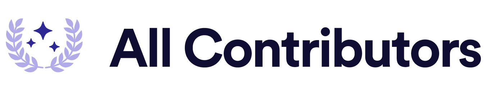

    

<table>
    <tr>
        <!-- Do not translate this table -->
        <td> Read these guidelines in </td>
        <td><a href="/README.md">English</a></td>
        <td><a href="/docs/pt-BR/README.md">Português</a></td>
        <td><a href="/docs/es-ES/README.md">Español</a></td>
        <td><a href="/docs/fr-FR/README.md">Français</a></td>
        <td><a href="/docs/ko-KR/README.md">한국어</a></td>
    </tr>
</table>

[![chat][chat-badge]][chat]
[![Build Status][build-badge]][build]
[![version][version-badge]][package]
[![MIT License][license-badge]][LICENSE]

[![PRs Welcome][prs-badge]][prs]
[![Implementations][implementations-badge]][implementations]
[![Donate][donate-badge]][donate]
[![Code of Conduct][coc-badge]][coc]

[![Watch on GitHub][github-watch-badge]][github-watch]
[![Star on GitHub][github-star-badge]][github-star]
[![Tweet][twitter-badge]][twitter]

This is a specification for recognizing contributors to an open source project in a way that rewards each and every contribution, not just code.

The basic idea is this:

> Use the project README (or other prominent public documentation page in the project) to recognize the contributions of members of the project community.

People are giving of themselves and their free time to contribute to open source projects in so many ways. It can be a real
time sink sometimes and so they should be praised for all their contributions (code or not).

Use this project as an example implementation of the all-contributors specification (see the [Contributors](#contributors) section below).

## Tools for updating your all-contributors table

If you find maintaining the list of contributors tedious, say hello to the [@all-contributors bot 🤖](https://github.com/all-contributors/all-contributors-bot)

If you prefer command line tools, there is also the [all-contributors CLI tool](https://www.npmjs.com/package/all-contributors-cli)

## Specification

### Mandatory
Open source projects should include the following mandatory items in order to support the All Contributors specification:

1. A "Contributors" section in a prominent site of the project repository documentation that includes a list of all project contributors
  - The goal should be to use the most prominent site of the project documentation when feasible.  In many cases, this is the project README file
  - Consider use of a CONTRIBUTORS file in the top level of the repository when the number of project contributors exceeds a level at which it is feasible to use the README file to acknowledge contributions.  In this case, a prominent link to the CONTRIBUTORS file should be included on the README page under the "Contributors" heading
2. The listings should be formatted as a table with the following information about the project contributors:
  - Name
  - URL link to a site where more information can be learned about the contributor.  This URL may be determined by the contributor at the project's discretion.
  - Indication of the Contribution Category in text or icon image format using the defined Contribution Categories and/or Contribution Categories emoji images (see below).
  - A link to the Contribution Category in text or emoji format using the defined Contribution Categories and/or [Contribution Categories emoji](#emoji-key).
    - The list of contributors can be spread across multiple lines (each technically being its own table) as needed.
    - The order of contributors is immaterial to the spec. Order them how you wish.
3. Projects should define contributors as those who contribute to a project in any of the Contribution Categories at any level of contribution.  This specification is, by definition, inclusive of all contributions.  In cases where projects deviate from the Contribution Categories or require a specific contribution level in order to meet criteria as a project contributor, the project should provide explicit documentation of the definitions that satisfy the project contributor criteria in the CONTRIBUTING document or a similar prominent public document at the top level of the project repository.  This specification recommends against exclusion of an individual from the Contributor list based upon perceived level of contribution.  Instead, projects should use indicators of effort within a list that remains inclusive of all contributors to the project at any level of effort.  If used, these effort indicators are at the discretion of the project and are not currently specified.

### Optional
Projects should consider the following optional items as part of their commitment to the All Contributors specification:

1. The user's avatar can be included and is recommended.
3. An optional link from the Contribution Category indicator to the category-specific contribution(s) can be included to provide additional information about the project contribution(s) as detailed in the section below.

## Emoji key 

Emoji | Represents | Links to | Comment
:---: | --- | --- | ---
💬 | Answering Questions (in Issues, Stack Overflow, Gitter, Slack, etc.)
🐛 | Bug reports | `https://github.com/${ownerName}/${repoName}/issues?q=author%3A${username}`
📝 | Blogposts | the blogpost
💼 | Business Development | | people who execute on the business end
💻 | Code | `https://github.com/${ownerName}/${repoName}/commits?author=${username}`
🖋 | Content (e.g. website copy) | where the content is used | blog posts are separate
📖 | Documentation | `https://github.com/${ownerName}/${repoName}/commits?author=${username}`, Wiki, or other source of documentation
🎨 | Design | the logo/iconography/visual design/etc.
💡 | Examples | the examples
📋 | Event Organizers | event page
💵 | Financial Support | relevant page | people or orgs who provide financial support
🔍 | Funding/Grant Finders | | people who help find financial support
🤔 | Ideas & Planning |
🚇 | Infrastructure (Hosting, Build-Tools, etc) | link to source file (like `travis.yml`) in repo, if applicable
📦 | Packaging/porting to support a new platform
🔌 | Plugin/utility libraries | the repo home
👀 | Reviewed Pull Requests
🛡️ | Security | | identify and/or reduce security threats, GDPR, Privacy, etc
🔧 | Tools | the repo home
🌍 | Translation | the translated content
⚠️ | Tests | `https://github.com/${ownerName}/${repoName}/commits?author=${username}`
✅ | Tutorials | the tutorial
📢 | Talks | the slides/recording/repo/etc.
📓 | User Testing | user test notes
📹 | Videos | the video

## Notes for repository maintainers
Contributors should be recognised as soon as the contribution is discovered to help ensure their efforts are not overlooked when the list gets updated at a later date. This can be difficult for contributions that are not the result of a commit to repository but do your best to minimise the time between the contribution and updating the list.

Being the owner or a maintainer of the repository does not mean you are solely responsible for keeping the list of contributors up to date. You should encourage contributors to add themselves to the list as much as possible. This can be in the form of a comment on the issue, blog or answer, or through more direct forms of communication where appropriate.

Many contributors may not realise that their efforts are sufficient for recognition in the contributors list. This might be because they have not read or understood the definition of a contributor as set out in this specification, or because they do not feel like it is significant enough. In these cases, you should still encourage them to add themselves, but it may be necessary for you to add the contributor yourself (though it's a good idea to do so in the form of a pull request to make sure they're ok with being added).

In the end, there are no hard and fast rules for when a contribution has to be added to the list, just do your best to be fair and to ensure all contributors are recognised.

## Contributors ✨

Thanks goes to these wonderful people ([emoji key][emojis]):

<!-- ALL-CONTRIBUTORS-LIST:START - Do not remove or modify this section -->
<!-- prettier-ignore -->
| [ <b>Kent C. Dodds</b>](https://kentcdodds.com) [💬](#question-kentcdodds "Answering Questions") [📖](https://github.com/kentcdodds/all-contributors/commits?author=kentcdodds "Documentation") [👀](#review-kentcdodds "Reviewed Pull Requests") [📢](#talk-kentcdodds "Talks") | [ <b>Divjot Singh</b>](http://bogas04.github.io) [📖](https://github.com/kentcdodds/all-contributors/commits?author=bogas04 "Documentation") [👀](#review-bogas04 "Reviewed Pull Requests") | [ <b>Ben Briggs</b>](http://beneb.info) [📖](https://github.com/kentcdodds/all-contributors/commits?author=ben-eb "Documentation") [👀](#review-ben-eb "Reviewed Pull Requests") | [ <b>James Monger</b>](https://github.com/Jameskmonger) [📖](https://github.com/kentcdodds/all-contributors/commits?author=Jameskmonger "Documentation") | [ <b>Jeroen Engels</b>](https://github.com/jfmengels) [📖](https://github.com/kentcdodds/all-contributors/commits?author=jfmengels "Documentation") [👀](#review-jfmengels "Reviewed Pull Requests") [🔧](#tool-jfmengels "Tools") | [ <b>Chris Simpkins</b>](https://github.com/chrissimpkins) [📖](https://github.com/kentcdodds/all-contributors/commits?author=chrissimpkins "Documentation") [👀](#review-chrissimpkins "Reviewed Pull Requests") | [ <b>F. Hemberger</b>](https://github.com/fhemberger) [📖](https://github.com/kentcdodds/all-contributors/commits?author=fhemberger "Documentation") |
| :---: | :---: | :---: | :---: | :---: | :---: | :---: |
| [ <b>Daniel Kraft</b>](https://github.com/frigginglorious) [📖](https://github.com/kentcdodds/all-contributors/commits?author=frigginglorious "Documentation") | [ <b>Mayank Badola</b>](https://github.com/mbad0la) [📖](https://github.com/kentcdodds/all-contributors/commits?author=mbad0la "Documentation") [🔧](#tool-mbad0la "Tools") | [ <b>Marco Biedermann</b>](https://www.marcobiedermann.com) [🎨](#design-marcobiedermann "Design") | [ <b>Itai Steinherz</b>](https://github.com/itaisteinherz) [📖](https://github.com/kentcdodds/all-contributors/commits?author=itaisteinherz "Documentation") | [ <b>Patrick Connolly</b>](http://nodescription.net) [📖](https://github.com/kentcdodds/all-contributors/commits?author=patcon "Documentation") | [ <b>Nikola Đuza</b>](http://nikolalsvk.github.io/) [📖](https://github.com/kentcdodds/all-contributors/commits?author=nikolalsvk "Documentation") | [ <b>Demian Dekoninck</b>](https://dem.be) [💻](https://github.com/kentcdodds/all-contributors/commits?author=DemianD "Code") |
| [ <b>Michael Peyper</b>](https://github.com/mpeyper) [📖](https://github.com/kentcdodds/all-contributors/commits?author=mpeyper "Documentation") | [ <b>Matheus Rocha Vieira</b>](http://matheu.srv.br) [🌍](#translation-MatheusRV "Translation") [💻](https://github.com/kentcdodds/all-contributors/commits?author=MatheusRV "Code") [📖](https://github.com/kentcdodds/all-contributors/commits?author=MatheusRV "Documentation") | [ <b>Robert Lluberes</b>](https://robertlluberes.com) [🌍](#translation-robertlluberes "Translation") | [ <b>Jake Bolam</b>](https://jakebolam.com) [📖](https://github.com/kentcdodds/all-contributors/commits?author=jakebolam "Documentation") [🔧](#tool-jakebolam "Tools") | [ <b>tbenning</b>](https://github.com/tbenning) [🎨](#design-tbenning "Design") | [ <b>Maximilian Berkmann</b>](maxcubing.wordpress.com) [📖](https://github.com/kentcdodds/all-contributors/commits?author=Berkmann18 "Documentation") [🌍](#translation-Berkmann18 "Translation") |
<!-- ALL-CONTRIBUTORS-LIST:END -->

This project follows the [all-contributors][all-contributors] specification.
Contributions of any kind are welcome!
We are also [looking for maintainers](https://github.com/all-contributors/all-contributors/issues/112)

## LICENSE

[MIT](LICENSE)

[chat-badge]: https://img.shields.io/badge/slack-join-ff69b4.svg?style=flat-square
[chat]: https://join.slack.com/t/all-contributors/shared_invite/enQtNTE3ODMyMTA4NTk0LTUwZDMxZGZkMmViMzYzYzk2YTM2NjRkZGM5Yzc0ZTc5NmYzNWY3Y2Q0ZTY3ZmFhZDgyY2E3ZmIzNWQwMTUxZmE
[build-badge]: https://img.shields.io/circleci/project/all-contributors/all-contributors/master.svg?style=flat-square
[build]: https://circleci.com/gh/all-contributors/all-contributors
[version-badge]: https://img.shields.io/npm/v/all-contributors.svg?style=flat-square
[package]: https://www.npmjs.com/package/all-contributors
[license-badge]: https://img.shields.io/npm/l/all-contributors.svg?style=flat-square
[license]: https://github.com/all-contributors/all-contributors/blob/master/LICENSE
[prs-badge]: https://img.shields.io/badge/PRs-welcome-brightgreen.svg?style=flat-square
[prs]: http://makeapullrequest.com
[donate-badge]: https://img.shields.io/badge/$-support-green.svg?style=flat-square
[donate]: https://kcd.im/donate
[coc-badge]: https://img.shields.io/badge/code%20of-conduct-ff69b4.svg?style=flat-square
[coc]: https://github.com/all-contributors/all-contributors/blob/master/other/CODE_OF_CONDUCT.md
[implementations-badge]: https://img.shields.io/badge/%F0%9F%92%A1-implementations-8C8E93.svg?style=flat-square
[implementations]: https://github.com/all-contributors/all-contributors/blob/master/other/IMPLEMENTATIONS.md
[github-watch-badge]: https://img.shields.io/github/watchers/all-contributors/all-contributors.svg?style=social
[github-watch]: https://github.com/all-contributors/all-contributors/watchers
[github-star-badge]: https://img.shields.io/github/stars/all-contributors/all-contributors.svg?style=social
[github-star]: https://github.com/all-contributors/all-contributors/stargazers
[twitter]: https://twitter.com/intent/tweet?text=Check%20out%20all-contributors!%20%E2%9C%A8%20Recognize%20all%20contributors,%20not%20just%20the%20ones%20who%20commit%20code%20%E2%9C%A8%20https://github.com/all-contributors/all-contributors%20%F0%9F%A4%97
[twitter-badge]: https://img.shields.io/twitter/url/https/github.com/all-contributors/all-contributors.svg?style=social
[emojis]: https://github.com/all-contributors/all-contributors#emoji-key
[all-contributors]: https://github.com/all-contributors/all-contributors
