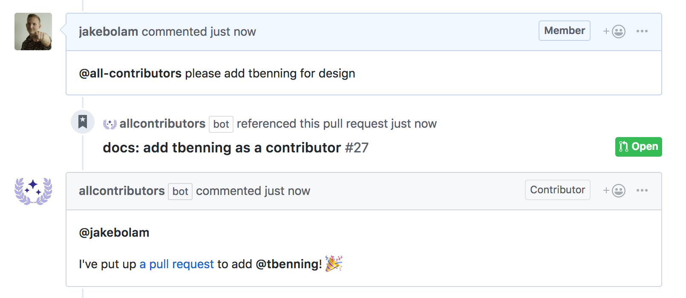

## The problem

You want to implement the [All Contributors](/docs/specification) spec, but don't
want to maintain the table by hand

## The bot solution 🤖

Hello, `@all-contributors` to help automate adding contributor acknowledgements

- [Installing the Bot](/docs/bot/installation)
- [Using the Bot](/docs/bot/usage)
- [Configuring the Bot](/docs/bot/configuration)

