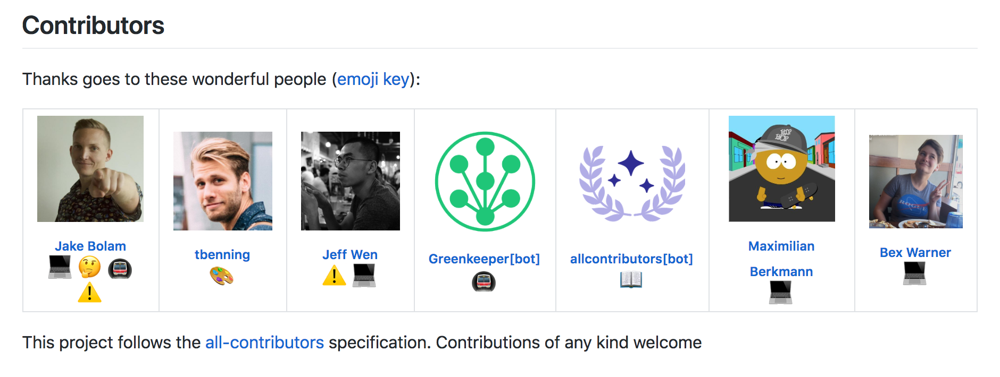

    

This is a specification for recognizing contributors to an open source project in a way that rewards each and every contribution, not just code.

The basic idea is this:

> Use the project README (or other prominent public documentation page in the project) to recognize the contributions of members of the project community.

People are giving of themselves and their free time to contribute to open source projects in so many ways. It can be a real
time sink sometimes and so they should be praised for all their contributions (code or not).

## The All Contributors Table
A project using the all-contributors spec table:

    

> There is [now a GitHub Bot](/docs/bot/overview) for automating the creation of your contributors table ✨ Say goodbye to command line tool dependencies and hello to the [@all-contributors bot 🤖](/docs/bot/overview)

## Whats next
- [The all contributors specification](/docs/specification)
- [Emoji Key (Contribution Types Reference)](/docs/emoji-key)
- [Notes for repository maintainers](/docs/repository-maintainers)
- [Automating the process using tools](/docs/tooling)

