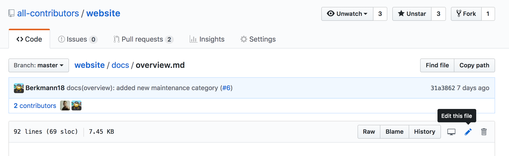

## Help improve the all-contributors documentation!

Pull Requests welcome for any level of improvement, from a small typo to new section, help us make the documentation better!

All the source code is available at [github.com/all-contributors/website](https://github.com/all-contributors/website/tree/master/docs)

## Editing Content

> **Pro Tip**: Every page has an _Edit_ button up the top, clicking this will take you straight to the GitHub source code for that page

Once on a file, click the 'pencil' icon to [easily edit the file inline](https://help.github.com/articles/editing-files-in-your-repository/)

    

